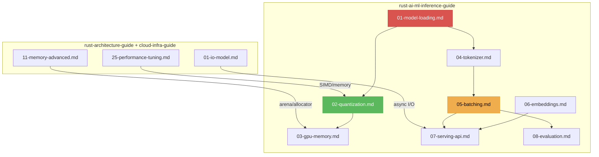

# Rust AI/ML Inference Guide V1.0.0

Vertical deepening of `rust-architecture-guide` and `rust-systems-cloud-infra-guide` for model inference, serving, and embedded ML. Assumes GPU acceleration, quantized models, and high-throughput batching.

## Core Philosophy

| Principle | Description |
|-----------|-------------|
| **Hardware Synergy** | Matrix multiplication maps to tensor cores. KV-cache fits in HBM. Attention patterns exploit L2. |
| **Quantization Physics** | Q4_0/Q8_0/K-quant map model weights to hardware-friendly int types. 4-bit = 4x less memory bandwidth. |
| **Batch Efficiency** | Continuous batching maximizes GPU utilization. Padding waste is minimized via dynamic batching. |
| **Jeet Kune Do** | One-pass token generation. KV-cache reuse. Speculative decoding for latency hiding. |

---

## Action 1: Model Loading & Format Handling

Models come in multiple formats. Rust inference must handle all of them.

- **GGUF** (llama.cpp format): Quantized weights, tokenizer embedded, metadata. `candle`/`llama-cpp-rs` for loading.
- **SafeTensors**: Safe serialization format. Random access without unsafe deserialization.
- **ONNX**: Open Neural Network Exchange. `ort` crate for ONNX Runtime bindings. Cross-framework.
- **Red Line**: Prohibit loading model weights from untrusted pickle/safetensors without checksum verification.

→ [references/01-model-loading.md](references/01-model-loading.md)

---

## Action 2: Quantization-Aware Inference

Quantization reduces model size and accelerates inference without significant quality loss.

- **GGUF Quant Types**: Q4_0 (4-bit), Q4_K_M (4-bit with K-quant), Q8_0 (8-bit), F16 (half precision)
- **Memory Bandwidth Reduction**: 4-bit quantization = ~4x less memory bandwidth for weight loading
- **`candle-quantized`**: Block-wise quantization. Min/max per block for dequantization.
- **Red Line**: Quantization introduces quality loss. Must evaluate perplexity/BLEU before deploying.

→ [references/02-quantization.md](references/02-quantization.md)

---

## Action 3: GPU Memory Management

GPU VRAM is the bottleneck. Every MB matters.

- **KV-Cache**: Key-Value cache grows with context length. Pre-allocate based on max context.
- **Layer Offloading**: Offload some layers to GPU, keep others on CPU (`n_gpu_layers` in llama.cpp)
- **Memory Pool**: Pre-allocate large buffers. Avoid per-request allocation/deallocation on GPU.
- **Red Line**: OOM on GPU = inference failure. Must monitor VRAM usage and apply backpressure.

→ [references/03-gpu-memory.md](references/03-gpu-memory.md)

---

## Action 4: Tokenizer & Text Processing

Tokenization is the bridge between raw text and model input.

- **`tokenizers` crate** (HuggingFace): BPE/WordPiece/Unigram tokenizers. `encode()`, `decode()`.
- **Special Tokens**: BOS, EOS, PAD, UNK, chat template tokens. Must match model training config.
- **Batched Encoding**: `encode_batch()` for parallel tokenization. Padding to max length with attention mask.
- **Red Line**: Mismatched tokenizer = garbage output. Must verify tokenizer.json matches model.

→ [references/04-tokenizer.md](references/04-tokenizer.md)

---

## Action 5: Batching & Continuous Batching

Serving multiple requests concurrently maximizes GPU utilization.

- **Static Batching**: Pad all requests to same length. Wasteful for variable-length inputs.
- **Continuous Batching** (vLLM-style): Requests enter/leave batch dynamically. No padding waste.
- **Prefill + Decode Splitting**: Prefill (process prompt) and decode (generate tokens) as separate GPU operations
- **Red Line**: Unbatched single-request inference = 10x lower throughput. Always batch.

→ [references/05-batching.md](references/05-batching.md)

---

## Action 6: Embedding & Vector Search

Embedding models convert text/images to vectors. Vector search finds nearest neighbors.

- **Embedding Models**: `candle-transformers` for BERT/sentence-transformers. Mean pooling for sentence embeddings.
- **Vector Database**: `qdrant`/`pgvector` for storage. HNSW index for approximate nearest neighbor (ANN).
- **Cosine Similarity**: Normalize vectors to unit length → dot product = cosine similarity
- **Red Line**: Unnormalized embeddings → distance metrics invalid. Must L2-normalize before storing.

→ [references/06-embeddings.md](references/06-embeddings.md)

---

## Action 7: Inference Serving & API Design

Model serving requires HTTP/gRPC APIs with streaming support.

- **HTTP Streaming**: SSE (Server-Sent Events) for token-by-token streaming. `axum` + `tokio-stream`.
- **gRPC**: Protobuf service definition. Bidirectional streaming for interactive use cases.
- **Load Balancing**: Multiple model replicas. Consistent hashing for KV-cache sticky sessions.
- **Red Line**: Timeout per request must be enforced. No single request can block the serving thread.

→ [references/07-serving-api.md](references/07-serving-api.md)

---

## Action 8: Evaluation & Benchmarking

Measure quality and performance before deploying.

- **Perplexity**: Measure language model quality. Lower = better. Compare before/after quantization.
- **Throughput**: Tokens/second. Measure at batch sizes 1, 4, 8, 16. GPU vs CPU.
- **TTFT** (Time to First Token): Latency from request to first token. Critical for UX.
- **Red Line**: Quantized model must not exceed 5% perplexity degradation vs FP16 baseline.

→ [references/08-evaluation.md](references/08-evaluation.md)

---

## Prohibitions Quick List

| Category | Prohibited | Mandatory |
|----------|------------|-----------|
| Model Loading | Untrusted weights without checksum | GGUF checksum / SafeTensors validation |
| Quantization | Unmeasured quality degradation | Perplexity/BLEU benchmark before deploy |
| GPU Memory | Unbounded KV-cache growth | Pre-allocation + backpressure on OOM |
| Tokenizer | Mismatched tokenizer config | Verify `tokenizer.json` matches model |
| Batching | Single-request inference | Continuous batching for throughput |
| Embeddings | Unnormalized vectors | L2-normalize before storing/searching |
| Serving | Unbounded per-request timeout | Timeout + cancellation |
| Streaming | Blocking token generation | SSE/gRPC streaming protocol |
| Evaluation | Unmeasured model quality | Perplexity + TTFT + throughput benchmarks |

---

## Document Relationship Map

---

## Reference Files

| File | Topic | Key Directive |
|------|-------|---------------|
| [01-model-loading.md](references/01-model-loading.md) | Model Loading & Formats | GGUF, SafeTensors, ONNX, checksum verification |
| [02-quantization.md](references/02-quantization.md) | Quantization-Aware Inference | Q4_0/Q8_0/K-quant, perplexity evaluation requirement |
| [03-gpu-memory.md](references/03-gpu-memory.md) | GPU Memory Management | KV-cache, layer offloading, memory pool, OOM backpressure |
| [04-tokenizer.md](references/04-tokenizer.md) | Tokenizer & Text Processing | BPE/WordPiece, special tokens, batched encoding |
| [05-batching.md](references/05-batching.md) | Batching & Continuous Batching | Static vs continuous, prefill/decode splitting |
| [06-embeddings.md](references/06-embeddings.md) | Embedding & Vector Search | BERT embeddings, cosine similarity, HNSW, normalization |
| [07-serving-api.md](references/07-serving-api.md) | Inference Serving & API | SSE streaming, gRPC, load balancing, timeouts |
| [08-evaluation.md](references/08-evaluation.md) | Evaluation & Benchmarking | Perplexity, TTFT, throughput, quantization quality |

---

## Changelog

### V1.0.0
- Initial framework: GGUF/SafeTensors/ONNX model loading, quantization (Q4/Q8/K-quant)
- GPU memory management: KV-cache, layer offloading, OOM backpressure
- HuggingFace tokenizers, continuous batching, prefill/decode splitting
- Embedding models, vector search, cosine similarity normalization
- SSE/gRPC serving API, perplexity/TTFT/throughput evaluation
- Aligned with rust-architecture-guide V9.1.0 and rust-systems-cloud-infra-guide V6.1.0