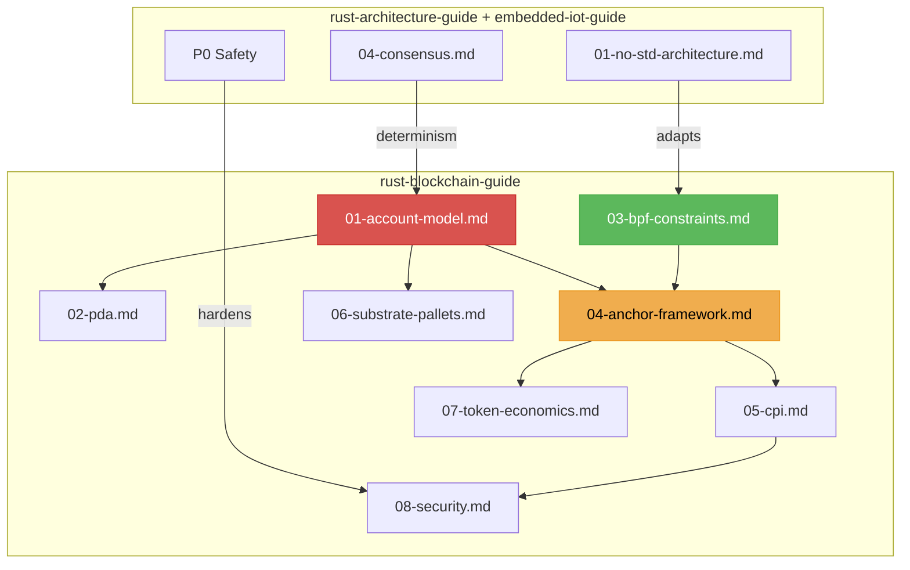

# Rust Blockchain & Web3 Guide V1.0.0

Vertical deepening of `rust-architecture-guide` and `rust-embedded-iot-guide` for blockchain programs (smart contracts). Assumes deterministic execution, verifiable compute, and hard resource constraints (BPF bytecode, gas metering).

## Core Philosophy

| Principle | Description |
|-----------|-------------|
| **Determinism** | Every transaction must produce identical state on every validator. Same inputs → same outputs. |
| **Account Model** | State is partitioned into accounts. Programs are stateless. Data lives in accounts. |
| **Verifiable Compute** | Every program execution must be reproducible. Gas metering bounds compute. |
| **Jeet Kune Do** | One-pass transaction processing. Anchor constraints fold validation + execution into one derive. |

---

## Action 1: Account Model & State Partitioning

Blockchain state is an account database, not a traditional database.

- **Solana**: Programs are stateless. Accounts hold state. `AccountInfo` with `data: Rc<RefCell<&mut [u8]>>`.
- **Substrate**: FRAME pallets with `StorageMap`/`StorageValue`. Merkle-Patricia trie backend.
- **Account Serialization**: `borsh` (Solana), `parity-scale-codec` (Substrate), `bincode` (NEAR)
- **Red Line**: Programs must not store state internally. All state must be in accounts.

→ [references/01-account-model.md](references/01-account-model.md)

---

## Action 2: Program Derived Addresses (PDA)

PDAs are deterministic addresses derived from seeds + program ID. No private key.

- **`Pubkey::find_program_address(&[seeds], &program_id)`**: Deterministic derivation
- **Bump Seed**: PDAs are off the ed25519 curve. Bump seed ensures address security.
- **Use Cases**: Escrow accounts, vaults, authority delegation, state compression
- **Red Line**: PDA seeds must include unique identifiers (user pubkey, nonce). Collision = drained account.

→ [references/02-pda.md](references/02-pda.md)

---

## Action 3: BPF Bytecode Constraints & no_std Hybrid

Solana programs compile to BPF (Berkeley Packet Filter) bytecode, not native machine code.

- **BPF Constraints**: No `std` (use `solana-program`). 200KB max program size. 200K CU budget.
- **No Floating Point**: BPF has no native f64/f32. Use fixed-point arithmetic (`u64` with 9 decimals).
- **No Dynamic Dispatch**: No `Box<dyn Trait>`, no `Rc`, no `Arc`. Static dispatch only.
- **Red Line**: Exceeding CU budget → transaction fails. Profile with `solana_compute_budget`.

→ [references/03-bpf-constraints.md](references/03-bpf-constraints.md)

---

## Action 4: Anchor Framework & Program Structure

Anchor is the standard Solana framework. Derive macros reduce boilerplate by 90%.

- **`#[program]`**: Defines program entry point. `pub mod my_program { ... }`
- **`#[derive(Accounts)]`**: Instruction account validation struct. `#[account(mut)]`, `#[account(signer)]`
- **`#[account]`**: Account data struct. `#[derive(InitSpace)]` for space calculation + discriminator.
- **Red Line**: Every instruction must validate all accounts via `#[derive(Accounts)]`. Never skip.

→ [references/04-anchor-framework.md](references/04-anchor-framework.md)

---

## Action 5: Cross-Program Invocation (CPI)

Programs call other programs. Token transfers, AMM swaps, oracle queries.

- **CPI**: `invoke(&instruction, &[account_infos])` or `invoke_signed()` for PDA authority
- **Token Standard**: SPL Token program. `transfer()`, `mint_to()`, `burn()`. Use `anchor_spl`.
- **Program Composability**: Check program ownership (`account.owner == expected_program_id`)
- **Red Line**: CPI calls must check return values. Silent failures = drained vaults.

→ [references/05-cpi.md](references/05-cpi.md)

---

## Action 6: Substrate FRAME Pallets

For Polkadot/Substrate chains, FRAME is the standard framework.

- **Pallets**: `#[frame::pallet]` module. `#[pallet::storage]`, `#[pallet::call]`, `#[pallet::event]`.
- **Weights**: Benchmark each extrinsic. `#[pallet::weight(T::WeightInfo::my_func())]`.
- **Runtime**: `construct_runtime!` macro assembles pallets into a chain.
- **Red Line**: Unbounded weight → block full. All extrinsics must have benchmark-derived weights.

→ [references/06-substrate-pallets.md](references/06-substrate-pallets.md)

---

## Action 7: Token Economics & SPL Standards

Token programs follow standardized interfaces.

- **SPL Token**: Fungible token standard. Mint, account, transfer, approve.
- **SPL Token-2022**: Extended token with transfer fees, confidential transfers, metadata.
- **SPL Associated Token Account (ATA)**: Deterministic PDA for user token accounts
- **Red Line**: Token arithmetic overflow → catastrophic loss. Use `checked_add`/`checked_sub` or `u64`.

→ [references/07-token-economics.md](references/07-token-economics.md)

---

## Action 8: Security & Auditing

Blockchain programs handle real money. Security is P0.

- **Reentrancy**: Never CPI to untrusted program after state mutation. Checks-Effects-Interactions.
- **Integer Overflow**: Use `checked_*` math. `overflow-checks = true` in release (Solana default).
- **Access Control**: Every instruction must verify signer authority. `#[account(signer)]` on Anchor.
- **Fuzzing**: `trident` framework for Solana program fuzzing. `cargo-fuzz` for parser/deserializer.
- **Red Line**: Programs holding value must be audited by third party before mainnet.

→ [references/08-security.md](references/08-security.md)

---

## Prohibitions Quick List

| Category | Prohibited | Mandatory |
|----------|------------|-----------|
| State | Internal program state | Account-based state (`#[account]`) |
| Arithmetic | Unchecked `+`/`-`/`*` | `checked_add`/`checked_sub`/`checked_mul` |
| Reentrancy | CPI after state mutation | Checks-Effects-Interactions pattern |
| BPF | Floating point (`f32`/`f64`) | Fixed-point `u64` with decimal scaling |
| BPF | Dynamic dispatch (`Box<dyn>`/`Rc`) | Static dispatch only |
| Accounts | Unvalidated instruction accounts | `#[derive(Accounts)]` validation |
| CPI | Unchecked return values | Verify `invoke()` result |
| PDA | Predictable seeds | Include unique identifiers, bump seed |
| Weights | Unbounded extrinsic weight | Benchmark-derived `#[pallet::weight]` |
| Security | Unaudited mainnet program | Third-party audit + formal verification |

---

## Document Relationship Map

---

## Reference Files

| File | Topic | Key Directive |
|------|-------|---------------|
| [01-account-model.md](references/01-account-model.md) | Account Model & State Partitioning | Solana/Substrate account architecture, serialization |
| [02-pda.md](references/02-pda.md) | Program Derived Addresses | Deterministic derivation, bump seeds, use cases |
| [03-bpf-constraints.md](references/03-bpf-constraints.md) | BPF & no_std Constraints | CU budget, no float, static dispatch only |
| [04-anchor-framework.md](references/04-anchor-framework.md) | Anchor Framework | #[program], #[derive(Accounts)], #[account] |
| [05-cpi.md](references/05-cpi.md) | Cross-Program Invocation | invoke(), invoke_signed(), SPL Token CPI |
| [06-substrate-pallets.md](references/06-substrate-pallets.md) | Substrate FRAME Pallets | #[frame::pallet], storage, weights, construct_runtime |
| [07-token-economics.md](references/07-token-economics.md) | Token Economics & SPL | SPL Token/Token-2022, ATA, arithmetic safety |
| [08-security.md](references/08-security.md) | Security & Auditing | Reentrancy, overflow, access control, trident fuzzing |

---

## Changelog

### V1.0.0
- Initial framework: account model (Solana + Substrate), PDA derivation, BPF constraints
- Anchor framework with #[derive(Accounts)] validation and #[account] data
- Cross-Program Invocation (CPI) with SPL Token standard
- Substrate FRAME pallets, weights benchmarking, construct_runtime
- Security: reentrancy prevention, checked math, access control, trident fuzzing
- Aligned with rust-architecture-guide V9.1.0 and rust-embedded-iot-guide V1.0.0