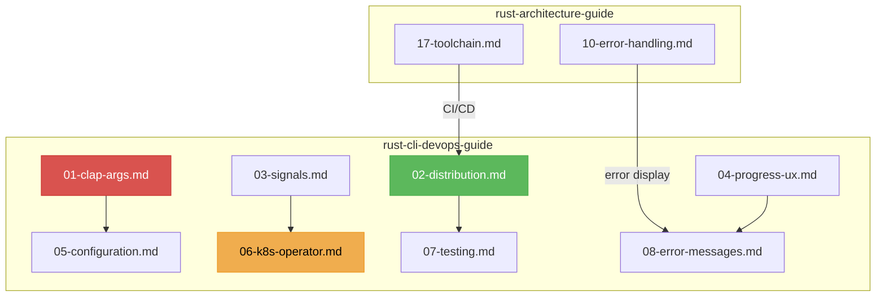

# Rust CLI & DevOps Guide V1.0.0

Vertical deepening of `rust-architecture-guide` for command-line tools, developer toolchains, and Kubernetes-native operators. The CLI is the universal interface — every backend engineer builds one eventually.

## Core Philosophy

| Principle | Description |
|-----------|-------------|
| **Simplicity** | A CLI should do one thing well. Compose via pipes, not monoliths. |
| **Composability** | Output structured data (JSON/CSV). Accept piped input. Be a good Unix citizen. |
| **Cross-Platform** | Windows, macOS, Linux. Path separators, line endings, signals — all handled transparently. |
| **Jeet Kune Do** | One-strike install (`curl \| sh`). Sub-millisecond startup. No warm-up. |

---

## Action 1: Argument Parsing with clap

`clap` derive mode is the standard. Structure subcommands as enum variants.

- **Derive API**: `#[derive(Parser)]`, `#[command(subcommand)]`, `#[arg(short, long)]`
- **Value Validation**: `value_parser!` for custom types, `PossibleValuesParser` for enums
- **Shell Completions**: `clap_complete` generates bash/zsh/fish completions at build time
- **Red Line**: Prohibit `std::env::args()` manual parsing in production CLIs. Use `clap` derive. Minimal tools (single flag, no subcommands) may use manual parsing with documented justification.

→ [references/01-clap-args.md](references/01-clap-args.md)

---

## Action 2: Cross-Platform Distribution

Users must be able to install your tool with zero friction.

- **`cargo-dist`**: Build release binaries for all platforms. Generate installers.
- **Package Managers**: Homebrew formula, npm wrapper (for JS ecosystem), `cargo install`
- **`curl | sh` script**: Minimal shell installer. Verify checksum. Add to PATH.
- **CI/CD**: GitHub Actions matrix build: `ubuntu-latest`, `macos-latest`, `windows-latest`
- **Red Line**: Release binaries must be stripped (`strip = true`) and LTO-optimized.

→ [references/02-distribution.md](references/02-distribution.md)

---

## Action 3: Signal Handling & Graceful Shutdown

CLI tools receive signals. Handle them or crash badly.

- **`SIGINT`/`CTRL_C`**: `tokio::signal::ctrl_c()` → cancel in-flight work → clean exit
- **`SIGPIPE`**: `#[cfg(unix)]` suppress broken pipe panic. Redirect to `std::io::sink()`.
- **Windows Console**: `SetConsoleCtrlHandler` via `ctrlc` crate for cross-platform signal handling
- **Red Line**: Unhandled `SIGTERM` in long-running CLI = data loss.

→ [references/03-signals.md](references/03-signals.md)

---

## Action 4: Progress UX & Terminal Output

Progress indicators transform a CLI from a black box to a trusted tool.

- **`indicatif`**: `ProgressBar`/`MultiProgress` with ETA, throughput, template-based display
- **`tracing` + `tracing-subscriber`**: `EnvFilter` for log levels. Structured JSON for CI environments.
- **`console`**: Terminal colors, truncation, user input (`Term::read_key`)
- **TUI (`ratatui`)**: Full-screen terminal apps with widgets, layouts, and event loop
- **Red Line**: Disable progress bars when stdout is not a TTY (`indicatif::ProgressBar::new_hidden`).

→ [references/04-progress-ux.md](references/04-progress-ux.md)

---

## Action 5: Configuration Management

CLI tools need config files, env vars, and default values in a sensible cascade.

- **Config Cascade**: CLI args > Env vars > Config file > Default values
- **`figment` / `config` crate**: Multi-source layered configuration
- **XDG spec**: `$XDG_CONFIG_HOME/app/config.toml` on Linux, `~/Library/` on macOS, `%APPDATA%` on Windows
- **Red Line**: Never hardcode paths. Use `dirs` crate. Never write config outside user's home.

→ [references/05-configuration.md](references/05-configuration.md)

---

## Action 6: Kubernetes Operator Pattern

For DevOps tools that manage K8s resources, the operator pattern is the standard.

- **`kube-rs`**: `Api<K>` for CRUD, `watcher()` for event streams, `Controller<K>` for reconcile loop
- **Reconciler Loop**: `async fn reconcile(obj: Arc<K>, ctx: Arc<Context>) → Result<Action>`
- **Finalizers**: Prevent resource deletion until cleanup is complete. `ownerReferences` for garbage collection.
- **CRD Generation**: `kube::CustomResource` derive → generate YAML manifest
- **Red Line**: Reconciler must be idempotent. Running it twice must produce the same state.

→ [references/06-k8s-operator.md](references/06-k8s-operator.md)

---

## Action 7: Testing CLI Applications

Testing a CLI requires different strategies than testing a library.

- **`assert_cmd`**: Run binary as subprocess, assert stdout/stderr/exit code
- **`trycmd` / `snapbox`**: Snapshot testing for terminal output — review diffs like code
- **`tempfile`**: Isolated temp directories for file-system side effects
- **Red Line**: Every critical subcommand and regression-prone command path must have end-to-end `assert_cmd` tests. Full coverage is aspirational; unit-test logic and E2E-test critical paths.

→ [references/07-testing.md](references/07-testing.md)

---

## Action 8: Error Messages & Debugging UX

CLI error messages are the primary debugging interface for users.

- **`miette` / `color-eyre`**: Rich error reporting with source code snippets and help text
- **Error Codes**: Unique exit codes for each failure mode. Document in `--help`.
- **`--verbose` / `--quiet`**: Control output verbosity. `-v`, `-vv`, `-vvv` for increasing detail.
- **Red Line**: Never print a raw backtrace to users. Use `miette::Report` with friendly messages.

→ [references/08-error-messages.md](references/08-error-messages.md)

---

## Prohibitions Quick List

| Category | Prohibited | Mandatory |
|----------|------------|-----------|
| Arg Parsing | Manual `std::env::args()` in production CLIs | `clap` derive |
| Progress | Progress bars piped to file | `is_terminal()` check, fallback to log |
| Paths | Hardcoded `~/.config` | `dirs` crate for XDG-compliant paths |
| Signals | Ignoring SIGTERM/CTRL_C | Graceful shutdown with cancellation |
| Error Display | Raw backtrace to users | `miette`/`color-eyre` friendly messages |
| Config | Single-file config only | Layered cascade: CLI > Env > File > Default |
| K8s Reconciler | Non-idempotent reconcile | Must converge on repeated runs |
| Release | Debug symbols in binary | `strip = true`, LTO |
| Install | Manual download + chmod | `cargo-dist` / Homebrew / `curl \| sh` |
| Testing | Manual CLI invocation | `assert_cmd` / `trycmd` snapshot tests |

---

## Document Relationship Map

---

## Reference Files

| File | Topic | Key Directive |
|------|-------|---------------|
| [01-clap-args.md](references/01-clap-args.md) | Argument Parsing | clap derive, subcommands, shell completions |
| [02-distribution.md](references/02-distribution.md) | Cross-Platform Distribution | cargo-dist, Homebrew, `curl \| sh` |
| [03-signals.md](references/03-signals.md) | Signal Handling | SIGINT/CTRL_C, SIGPIPE, Windows console |
| [04-progress-ux.md](references/04-progress-ux.md) | Progress UX & Terminal Output | indicatif, tracing, ratatui TUI |
| [05-configuration.md](references/05-configuration.md) | Configuration Management | figment/config, XDG cascade |
| [06-k8s-operator.md](references/06-k8s-operator.md) | Kubernetes Operator Pattern | kube-rs, reconciler, CRD, finalizers |
| [07-testing.md](references/07-testing.md) | Testing CLI Apps | assert_cmd, trycmd/snapbox, tempfile |
| [08-error-messages.md](references/08-error-messages.md) | Error Messages & UX | miette, color-eyre, exit codes |

---

## Changelog

### V1.0.0
- Initial framework: clap derive parsing, cross-platform distribution via cargo-dist
- Signal handling, progress UX with indicatif/ratatui, layered configuration
- Kubernetes operator pattern with kube-rs, reconciler loops, CRD generation
- CLI testing with assert_cmd/trycmd, rich error messages with miette
- Aligned with rust-architecture-guide V9.1.0