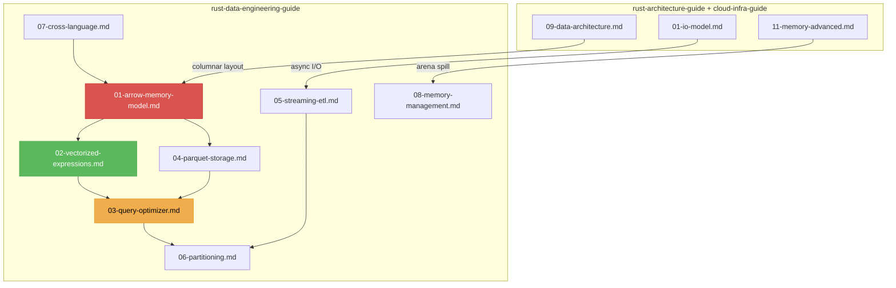

# Rust Data Engineering Guide V1.0.0

Vertical deepening of `rust-architecture-guide` and `rust-systems-cloud-infra-guide` for data-intensive systems. Assumes TB-PB scale data, columnar execution, and SIMD-accelerated compute.

## Core Philosophy

| Principle | Description |
|-----------|-------------|
| **Columnar Physics** | Data lives in columns, not rows. Cache lines are filled with homogeneous types. Vectorization is natural. |
| **Parquet-Native** | Storage format is not an afterthought — predicate pushdown, row group pruning, statistics are first-class |
| **Mechanical Sympathy** | Arrow arrays align with CPU cache lines. String dictionaries fit in L2. Bitmap filters fit in L1. |
| **Jeet Kune Do** | One-pass multi-column projection. Late materialization. No unnecessary deserialization. |

---

## Action 1: Apache Arrow Columnar Memory Model

Arrow defines the physical memory layout that all operators share.

- **Arrays**: `PrimitiveArray<T>`, `StringArray`, `ListArray`, `StructArray` — typed buffers with null bitmaps
- **Chunked Arrays** (`ChunkedArray<T>`): Zero-copy concatenation of same-type arrays
- **RecordBatch**: A table slice — Schema + multiple Arrays with equal length
- **Red Line**: Never copy Arrow data between operators. Use `Arc<ArrayData>` for shared ownership.

→ [references/01-arrow-memory-model.md](references/01-arrow-memory-model.md)

---

## Action 2: Vectorized Expression Evaluation

Expressions operate on entire columns at once, not row-by-row.

- **Columnar Expressions**: `col("price") * col("quantity")` → vectorized multiply
- **SIMD Acceleration**: `std::simd` for int/float bulk ops (filter, arithmetic, comparison)
- **Bitmap Filtering**: `BooleanArray` + `filter()` → branch-free selection
- **Null Handling**: Null bitmap propagation without branching per element
- **Red Line**: Row-by-row evaluation in hot paths collapses performance. Must batch.

→ [references/02-vectorized-expressions.md](references/02-vectorized-expressions.md)

---

## Action 3: Query Optimizer Design

Logical plan → Optimized logical plan → Physical plan → Execution.

- **Rule-Based Optimization (RBO)**: Predicate pushdown, projection pruning, constant folding, filter merge
- **Cost-Based Optimization (CBO)**: Statistics (min/max/null_count/distinct_count), join reordering, cardinality estimation
- **Physical Planning**: HashJoin vs SortMergeJoin, broadcast vs shuffle exchange
- **Red Line**: Predicate pushdown must reach the storage layer (Parquet row group statistics).

→ [references/03-query-optimizer.md](references/03-query-optimizer.md)

---

## Action 4: Parquet & Storage Layer

Parquet is the universal columnar storage format. Every data system must read/write it natively.

- **Row Groups**: ~128MB chunks, each with column chunks, each with pages
- **Statistics**: min/max/null_count per column chunk → skip entire row groups at query time
- **Encoding**: Dictionary, RLE, Delta, Bit-Packed — choose based on data distribution
- **Red Line**: Never read entire Parquet file when predicate can skip row groups. Use `RowSelection`.

→ [references/04-parquet-storage.md](references/04-parquet-storage.md)

---

## Action 5: Streaming ETL & Windowing

Infinite data streams require different abstractions than batch processing.

- **`Stream` trait**: Async iteration with backpressure. `buffered(n)` for controlled concurrency.
- **Windowing**: Tumbling, sliding, session windows. Watermarks for late-arrival tolerance.
- **State Management**: Incremental aggregation with RocksDB/`moka` state backend
- **Exactly-Once**: Checkpoint-based commit protocol (source offset + state snapshot)
- **Red Line**: Unbounded state in streaming operators → OOM. Must enforce eviction policy.

→ [references/05-streaming-etl.md](references/05-streaming-etl.md)

---

## Action 6: Partitioning & Shuffling

Data distribution across nodes/threads is the scaling bottleneck.

- **Hash Partitioning**: `hash(join_key) % num_partitions` → deterministic routing
- **Range Partitioning**: Sort-based boundary, cost proportional to data skew
- **Broadcast Join**: Small table replicated to all partitions; large table stays local
- **Shuffle**: Network transfer + disk spill. Use `tokio` async I/O for concurrent shuffle streams.
- **Red Line**: Data skew (>10x largest partition) must be detected and mitigated (salt, split, or broadcast).

→ [references/06-partitioning.md](references/06-partitioning.md)

---

## Action 7: Cross-Language Data Interchange

Rust engines serve Python/Node.js/Java clients. Zero-copy is critical at language boundaries.

- **PyO3 + Arrow**: Pass Arrow C Data Interface (`ArrowArrayStream`) — zero-copy PyArrow ↔ Rust
- **napi-rs**: Node.js Buffer → Arrow `Buffer` — zero-copy across V8 boundary
- **Flight/Flight SQL**: gRPC-based Arrow streaming protocol for network transfer
- **Red Line**: Prohibit `serde_json` for bulk data handoff. Use Arrow IPC/Flight.

→ [references/07-cross-language.md](references/07-cross-language.md)

---

## Action 8: Memory Management for Analytics

Analytics workloads have unique memory patterns: large allocations, short-lived intermediates.

- **Arena per Query**: `bumpalo` for intermediate expression results. Batch reclamation at query end.
- **Spill-to-Disk**: When memory exceeds budget, sort/join intermediates spill to disk via `tempfile`
- **String Interning**: `string_cache` / `lasso` for repeated categorical strings (city names, status codes)
- **Red Line**: Unbounded memory per query. Must configure `memory_limit` and enforce spill.

→ [references/08-memory-management.md](references/08-memory-management.md)

---

## Prohibitions Quick List

| Category | Prohibited | Mandatory |
|----------|------------|-----------|
| Row-by-Row Eval | `for row in df.iter()` on hot paths | Vectorized columnar expressions |
| Arrow Copy | `array.clone()` between operators | `Arc<ArrayData>` shared ownership |
| JSON Handoff | `serde_json` for Py↔Rust data | Arrow C Data Interface / Flight |
| Predicate Late | Filter at application layer | Pushdown to Parquet row group level |
| Unbounded Stream State | No eviction policy | TTL / LRU / watermark-based cleanup |
| Data Skew Ignored | Assume uniform distribution | Detect skew, apply salt/broadcast |
| Unbounded Query Mem | No memory limit per query | `memory_limit` + spill-to-disk |
| String Duplication | `String` for repeated values | Dictionary encoding / string interning |

---

## Document Relationship Map

---

## Reference Files

| File | Topic | Key Directive |
|------|-------|---------------|
| [01-arrow-memory-model.md](references/01-arrow-memory-model.md) | Arrow Columnar Memory Model | Array/Buffer/RecordBatch zero-copy architecture |
| [02-vectorized-expressions.md](references/02-vectorized-expressions.md) | Vectorized Expression Evaluation | SIMD bulk ops, bitmap filtering, null propagation |
| [03-query-optimizer.md](references/03-query-optimizer.md) | Query Optimizer Design | RBO/CBO, predicate pushdown, join reordering |
| [04-parquet-storage.md](references/04-parquet-storage.md) | Parquet & Storage Layer | Row groups, statistics, encoding, predicate pushdown |
| [05-streaming-etl.md](references/05-streaming-etl.md) | Streaming ETL & Windowing | Stream trait, windows, watermarks, exactly-once |
| [06-partitioning.md](references/06-partitioning.md) | Partitioning & Shuffling | Hash/range/broadcast, data skew mitigation |
| [07-cross-language.md](references/07-cross-language.md) | Cross-Language Data Interchange | PyO3 Arrow, napi-rs, Flight protocol |
| [08-memory-management.md](references/08-memory-management.md) | Memory Management for Analytics | Arena per query, spill-to-disk, string interning |

---

## Changelog

### V1.0.0
- Initial framework: Arrow memory model, vectorized expressions, query optimizer
- Parquet storage layer with predicate pushdown and statistics
- Streaming ETL with windowing and exactly-once semantics
- Partitioning strategies, cross-language data interchange, analytics memory management
- Aligned with rust-architecture-guide V9.1.0 and rust-systems-cloud-infra-guide V6.1.0