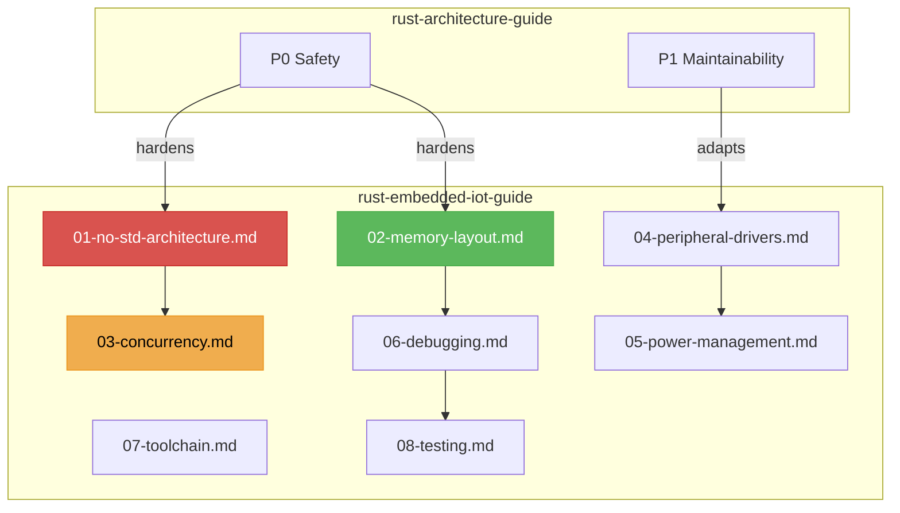

# Rust Embedded & IoT Guide V1.0.0

Vertical deepening of `rust-architecture-guide` for bare-metal and RTOS-based embedded systems. Assumes constrained hardware (KB of RAM, MHz of clock), no operating system, real-time deadlines.

## Core Philosophy

| Principle | Description |
|-----------|-------------|
| **Mechanical Sympathy** | Code directly maps to MMIO registers — no kernel, no syscall, no page table |
| **Determinism** | Every instruction cycle is accounted for; interrupt latency is bounded and measured |
| **Minimalism** | `no_std` by default; `alloc` is a luxury decision; every byte of `.bss` is audited |
| **Jeet Kune Do** | One-strike power cycles; flash-friendly data structures; DMA as the ultimate zero-copy |

---

## Action 1: no_std Architecture & Crate Layering

Embedded Rust code has no `std`. The architecture follows a strict five-layer abstraction:

```
Application → BSP (Board Support) → HAL → PAC → Cortex-M/RISC-V Core
```

- **PAC** (Peripheral Access Crate): Auto-generated from SVD via `svd2rust`. Unsafe MMIO.
- **HAL**: Implements `embedded-hal` traits. Safe API over PAC. Hardware-agnostic.
- **BSP**: Board-specific pin assignments, clock trees, peripheral configuration.
- **Red Line**: Application code must never directly touch PAC registers.

→ [references/01-no-std-architecture.md](references/01-no-std-architecture.md)

---

## Action 2: Memory Layout & Linker Script Control

In bare-metal, there is no OS to set up `.bss`/`.data`. You must:

- Define `memory.x` linker script: FLASH origin/length, RAM origin/length
- Implement `pre_init` in assembly: copy `.data` to RAM, zero `.bss`
- Audit stack usage per function (`cargo-call-stack`)
- **Red Line**: Stack overflow in embedded = undefined behavior. Must use `flip-link` or MPU stack guard.

→ [references/02-memory-layout.md](references/02-memory-layout.md)

---

## Action 3: Interrupt-Driven Concurrency

No threads. No `std::sync`. Concurrency is interrupt-driven.

- **RTIC** (Real-Time Interrupt-driven Concurrency): Static priority ceiling protocol, deadlock-free by construction
- **Embassy**: Async executor on bare-metal. `#[embassy_executor::task]`, `await` on DMA completion
- **Red Line**: Prohibit busy-waiting (`loop { if flag {} }`). Use interrupt or WFI/WFE.
- **Red Line**: `static mut` for shared state is UB. Use `CriticalSection` or RTIC resource locks.

→ [references/03-concurrency.md](references/03-concurrency.md)

---

## Action 4: Peripheral Driver Development

Every peripheral is a state machine with hardware-backed constraints.

- SPI/I2C/UART: Implement `embedded-hal` traits. Use DMA for bulk transfers.
- GPIO: Input/Floating/PullUp/PullDown/Analog/AlternateFunction — typed state machine.
- ADC/DAC: Calibration, sampling rate, DMA double-buffering.
- Timer/PWM: Capture/compare, dead-time insertion for motor control.
- **Red Line**: Prohibit bypassing HAL to write raw registers outside PAC crate.

→ [references/04-peripheral-drivers.md](references/04-peripheral-drivers.md)

---

## Action 5: Power Management & Battery Life

Every µA matters for battery-powered devices.

- Sleep/Deep-Sleep/Standby state machine. Wake sources: RTC, external interrupt, WDT.
- Clock gating: disable unused peripheral clocks. Dynamic frequency scaling.
- **Red Line**: Must measure actual current draw with power profiler (not simulator). Target < 10µA in deep sleep.

→ [references/05-power-management.md](references/05-power-management.md)

---

## Action 6: Hardware Debugging & Observability

No `println!` to console. Debugging requires hardware tools.

- **probe-rs** / **OpenOCD** + GDB: Flash, debug, RTT (Real-Time Transfer) channels
- **defmt**: Binary-efficient logging framework (strings are interned, not transmitted)
- **ITM/SWO**: ARM CoreSight trace for performance profiling
- Logic analyzer: Protocol-level debugging for SPI/I2C/UART timing violations
- **Red Line**: Release builds must strip debug symbols. Measure binary size after `objcopy`.

→ [references/06-debugging.md](references/06-debugging.md)

---

## Action 7: Build System & Toolchain

- `rust-toolchain.toml`: Pin nightly/stable, target (`thumbv7em-none-eabi`, `riscv32imac-unknown-none-elf`)
- `cargo-embed` / `cargo-flash` for consistent flashing
- `cargo-generate` templates for project scaffolding
- **Red Line**: Never compile embedded project without target-specific `rust-toolchain.toml`

→ [references/07-toolchain.md](references/07-toolchain.md)

---

## Action 8: Testing on Hardware

Unit tests on host (`cargo test --target x86_64`), integration on target.

- `defmt-test`: Test harness that runs on hardware
- Hardware-in-the-loop (HIL): Automate flash → run → check RTT output
- `cargo-modules`: Audit module graph for PAC leakage
- **Red Line**: Critical safety paths (motor control, medical) must pass HIL tests on real hardware

→ [references/08-testing.md](references/08-testing.md)

---

## Prohibitions Quick List

| Category | Prohibited | Mandatory |
|----------|------------|-----------|
| Standard Library | `use std::*` | `#![no_std]` + optional `extern crate alloc` |
| Dynamic Allocation | `Box`, `Vec` without allocator | Static buffers, `heapless` collections |
| Main Function | `fn main()` | `#[entry]` or `#[cortex_m_rt::entry]` |
| Threading | `std::thread`, `tokio::spawn` | RTIC tasks or Embassy async |
| Shared State | `static mut` | `CriticalSection`, RTIC resource locks |
| Busy-Wait | `loop { if flag {} }` | WFI/WFE, interrupt-driven wake |
| Stack Overflow | Unaudited recursion/deep frames | `flip-link`, MPU stack guard, `cargo-call-stack` |
| Debug Logging | `println!`, `log` crate | `defmt` / RTT |
| Raw Registers | Direct `write_volatile` in app | PAC → HAL → BSP abstraction |
| Unmeasured Power | Guess-based optimization | Power profiler with µA measurement |
| Release Symbols | Debug info in release | `strip = true`, `opt-level = "z"` |

---

## Document Relationship Map



---

## Reference Files

| File | Topic | Key Directive |
|------|-------|---------------|
| [01-no-std-architecture.md](references/01-no-std-architecture.md) | no_std Architecture & Crate Layering | PAC→HAL→BSP→App five-layer model |
| [02-memory-layout.md](references/02-memory-layout.md) | Memory Layout & Linker Scripts | `memory.x`, stack audit, `flip-link` |
| [03-concurrency.md](references/03-concurrency.md) | Interrupt-Driven Concurrency | RTIC priority ceiling, Embassy async |
| [04-peripheral-drivers.md](references/04-peripheral-drivers.md) | Peripheral Driver Development | SPI/I2C/UART/GPIO/ADC typed state machines |
| [05-power-management.md](references/05-power-management.md) | Power Management | Sleep states, clock gating, battery budget |
| [06-debugging.md](references/06-debugging.md) | Hardware Debugging | probe-rs, defmt, RTT, ITM/SWO |
| [07-toolchain.md](references/07-toolchain.md) | Build System & Toolchain | rust-toolchain.toml, cargo-embed, templates |
| [08-testing.md](references/08-testing.md) | Testing on Hardware | defmt-test, HIL, hardware-in-the-loop CI |

---

## Changelog

### V1.0.0
- Initial framework: no_std architecture, memory layout, RTIC/Embassy concurrency
- Peripheral driver development with `embedded-hal` traits
- Power management, hardware debugging, toolchain, and HIL testing
- Aligned with rust-architecture-guide V9.1.0 as parent constitution