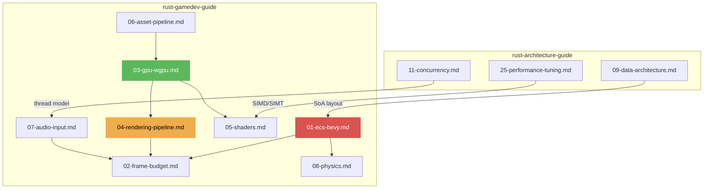

# Rust Game Development Guide V1.0.0

Vertical deepening of `rust-architecture-guide` for real-time game engines, rendering, and interactive applications. Assumes 16ms frame budget, GPU-driven rendering, and data-oriented design.

## Core Philosophy

| Principle | Description |
|-----------|-------------|
| **Frame Budget** | Every system runs in < 16ms (60 FPS) or < 8ms (120 FPS). Budget is law. |
| **Data-Oriented** | Entities are data; systems are functions. ECS separates data from behavior. SoA layout caches friendly. |
| **GPU-Friendly** | Minimize CPU-GPU synchronization. Batch draw calls. Staging belts for uploads. |
| **Jeet Kune Do** | One-pass rendering. Frustum cull before dispatch. Early-Z before fragment shader. |

---

## Action 1: ECS Architecture with Bevy

Entity-Component-System is the standard game architecture in Rust.

- **Entities**: Lightweight IDs. No data. No behavior. Just existence.
- **Components**: Plain data structs (`Position`, `Velocity`, `Health`). Derive `Component`.
- **Systems**: Functions that iterate queries. `fn move_system(mut query: Query<(&mut Position, &Velocity)>)`
- **Resources**: Global singletons (`Time`, `AssetServer`, `Input<KeyCode>`)
- **Red Line**: Prohibit OOP inheritance hierarchies. ECS is flat. Components are tags.

→ [references/01-ecs-bevy.md](references/01-ecs-bevy.md)

---

## Action 2: Frame Budget & Fixed Timestep

Every frame must complete within the target budget.

- **Fixed Timestep**: Physics runs at fixed rate (e.g., 60 Hz) independent of render rate
- **Interpolation**: Render interpolates between two physics states for smooth motion
- **Frame Pacing**: `Time::delta()` for frame-rate independent movement. `bevy_framepace` for VSync control.
- **Red Line**: Physics in variable timestep → non-deterministic behavior. Must use fixed timestep.

→ [references/02-frame-budget.md](references/02-frame-budget.md)

---

## Action 3: GPU Resource Lifecycle with wgpu

GPU resources have unique lifetime and synchronization requirements.

- **Buffers**: `wgpu::Buffer` for vertex/index/uniform/storage. `BufferUsages` flags.
- **Textures**: `wgpu::Texture` with `TextureView` for sampling. Mipmap generation.
- **Staging Belt**: CPU-writable staging buffer → `copy_buffer_to_buffer` → GPU buffer
- **Bind Groups**: Group resources (buffer + texture + sampler) for shader access
- **Red Line**: Prohibit mapping GPU buffers directly on render thread. Use staging belt.

→ [references/03-gpu-wgpu.md](references/03-gpu-wgpu.md)

---

## Action 4: Rendering Pipeline Architecture

The rendering pipeline transforms 3D/2D data into pixels on screen.

- **Render Graph**: Passes with input/output attachments. Dependency-based ordering.
- **Frustum Culling**: AABB/sphere test against camera frustum. Eliminate invisible objects early.
- **LOD (Level of Detail)**: Distance-based mesh/ texture resolution. Mipmaps for textures.
- **Instancing**: Draw many copies of the same mesh with per-instance data (transform, color)
- **Red Line**: Draw calls must be batched. < 1000 draw calls per frame target for 60 FPS.

→ [references/04-rendering-pipeline.md](references/04-rendering-pipeline.md)

---

## Action 5: Shader Programming with naga/wgsl

Shaders run on GPU. Rust ecosystem uses WGSL (WebGPU Shading Language) and naga.

- **WGSL**: Typed shader language. Entry points: `@vertex`, `@fragment`, `@compute`.
- **naga**: Compile GLSL/SPIR-V/MSL/WGSL → WGSL. Cross-platform shader translation.
- **Compute Shaders**: GPU parallel computation (particle systems, post-processing). `@compute @workgroup_size(64)`.
- **Red Line**: Shader hot-reloading must be supported in development. `AssetServer::watch_for_changes()`.

→ [references/05-shaders.md](references/05-shaders.md)

---

## Action 6: Asset Pipeline

Games have thousands of assets. Loading must be async and cache-aware.

- **AssetServer**: `asset_server.load("models/player.glb")` → returns `Handle<Mesh>`. Async.
- **Hot Reloading**: File watcher detects changes → reload asset → update handles in-place
- **Asset Preprocessing**: Compress textures (BC7/ASTC), optimize meshes, pack atlases
- **Red Line**: Never synchronously load assets on the main thread. Use `AssetServer` with async handles.

→ [references/06-asset-pipeline.md](references/06-asset-pipeline.md)

---

## Action 7: Audio & Input Systems

Game feel depends on responsive input and spatial audio.

- **Audio**: `kira` for spatial audio (3D positioning, attenuation). `rodio` for simple playback.
- **Input**: `Input<KeyCode>`, `Input<MouseButton>`, `Input<GamepadButton>`. Action mapping via `leafwing-input-manager`.
- **Input Buffering**: Collect inputs per frame. Process in fixed update. Avoid "one input = many actions".
- **Red Line**: Audio and input must run on separate threads from rendering.

→ [references/07-audio-input.md](references/07-audio-input.md)

---

## Action 8: Physics & Collision Detection

Physics runs at fixed timestep. Collision detection drives gameplay.

- **rapier**: Pure-Rust physics. Rigid bodies, colliders, joints, ray casting.
- **Collision Layers**: Group/ mask filtering. `CollisionGroups` for layer-based filtering.
- **Spatial Partitioning**: Broadphase (AABB tree) → narrowphase (GJK/EPA for convex, SAT for polyhedra)
- **Red Line**: Physics must run at fixed timestep. Variable timestep → non-deterministic simulation.

→ [references/08-physics.md](references/08-physics.md)

---

## Prohibitions Quick List

| Category | Prohibited | Mandatory |
|----------|------------|-----------|
| Architecture | OOP class hierarchy | ECS: flat components + systems |
| Physics | Variable timestep | Fixed timestep (60/120 Hz) |
| GPU Buffer Map | Direct map on render thread | Staging belt async upload |
| Draw Calls | Unbatched per-object draws | Instancing + batching (< 1000 dc/frame) |
| Asset Loading | Sync load on main thread | `AssetServer` + async handles |
| Shaders | No hot-reload in dev | `AssetServer::watch_for_changes()` |
| Input | Process input outside fixed update | Buffer + process in fixed timestep |
| Audio | Audio on render thread | Separate thread via `kira` |
| Frame Budget | Over-budget systems | Profile, cull, LOD, budget enforcement |

---

## Document Relationship Map

---

## Reference Files

| File | Topic | Key Directive |
|------|-------|---------------|
| [01-ecs-bevy.md](references/01-ecs-bevy.md) | ECS Architecture with Bevy | Entities/Components/Systems/Resources, queries, events |
| [02-frame-budget.md](references/02-frame-budget.md) | Frame Budget & Timestep | Fixed timestep, interpolation, frame pacing, budget profiling |
| [03-gpu-wgpu.md](references/03-gpu-wgpu.md) | GPU Resource Lifecycle | Buffers, textures, staging belts, bind groups, synchronization |
| [04-rendering-pipeline.md](references/04-rendering-pipeline.md) | Rendering Pipeline | Render graph, frustum culling, LOD, instancing |
| [05-shaders.md](references/05-shaders.md) | Shader Programming | WGSL, naga cross-compilation, compute shaders, hot-reload |
| [06-asset-pipeline.md](references/06-asset-pipeline.md) | Asset Pipeline | Async loading, hot reloading, preprocessing, compression |
| [07-audio-input.md](references/07-audio-input.md) | Audio & Input Systems | kira spatial audio, input buffering, action mapping |
| [08-physics.md](references/08-physics.md) | Physics & Collision | rapier rigid bodies, collision layers, spatial partitioning |

---

## Changelog

### V1.0.0
- Initial framework: Bevy ECS architecture, frame budget management, fixed timestep
- wgpu GPU resource lifecycle with staging belts and bind groups
- Rendering pipeline with frustum culling, LOD, and instancing
- WGSL shaders, naga compilation, asset pipeline with hot-reload
- Audio (kira), input buffering, rapier physics at fixed timestep
- Aligned with rust-architecture-guide V9.1.0