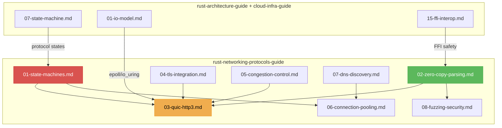

# Rust Networking Protocols Guide V1.0.0

Vertical deepening of `rust-architecture-guide` and `rust-systems-cloud-infra-guide` for network protocol engineering. Covers the full stack from wire format parsing to application-level protocol state machines.

## Core Philosophy

| Principle | Description |
|-----------|-------------|
| **Protocol First** | The protocol specification is the source of truth. Code is the executable version of the RFC. |
| **Mechanical Sympathy** | Wire format parsing aligns with CPU branch predictor. Zero-copy at every layer boundary. |
| **Defense in Depth** | Every byte from the network is hostile. Validate at ingress. Fuzz at integration. |
| **Jeet Kune Do** | Parse with one pass. State machines fold all edge cases into a closed set of transitions. |

---

## Action 1: Protocol State Machine Modeling

Every protocol is a finite state machine. Model it as such.

- **Typed States**: `enum State { Handshake, Established, Closing, Closed }` — compiler-enforced transitions
- **tokio-util Codec**: `Encoder` + `Decoder` traits. Frame-level parsing with backpressure.
- **Layered Protocol Stacks**: L2 (Ethernet) → L3 (IP) → L4 (TCP/UDP) → L5 (TLS) → L7 (HTTP/gRPC)
- **Red Line**: Protocol states must be exhaustive. Missing transitions = panics or hangs.

→ [references/01-state-machines.md](references/01-state-machines.md)

---

## Action 2: Zero-Copy Wire Parsing

Parse network bytes without allocating intermediate buffers.

- **`nom` / `winnow`**: Combinator-based parsing on `&[u8]`. Zero-copy by default.
- **Streaming Parsers**: `winnow::Partial` for incomplete input — resume parsing when more data arrives
- **Binary Protocols**: Fixed-width headers + length-prefixed payloads. Skip fields via `seek`.
- **Red Line**: Never allocate a `Vec<u8>` copy of parsed fields. References to input buffer.

→ [references/02-zero-copy-parsing.md](references/02-zero-copy-parsing.md)

---

## Action 3: QUIC & HTTP/3 Implementation

QUIC is TCP+TLS+HTTP/2 reimagined on UDP with 0-RTT and connection migration.

- **Quinn / quiche / s2n-quic**: Choose based on platform and feature requirements
- **Stream Multiplexing**: Unlimited independent streams per connection, no head-of-line blocking
- **0-RTT Data**: Security trade-offs — replay-safe idempotent requests only
- **Connection Migration**: Survive IP address changes (mobile/Wi-Fi handoff) via connection IDs
- **Red Line**: 0-RTT replay protection must be handled at the application layer.

→ [references/03-quic-http3.md](references/03-quic-http3.md)

---

## Action 4: TLS Integration

TLS is not optional for public internet protocols. All internet-facing production protocols must encrypt by default. Internal trusted LAN services, Unix socket control planes, and WireGuard/IPsec mesh endpoints may omit TLS with documented threat model rationale.

- **rustls**: Pure-Rust TLS. `ServerConfig`/`ClientConfig` with `Arc<CryptoProvider>`.
- **Certificate Management**: `rcgen` for self-signed, `rustls-acme` for Let's Encrypt automation
- **ALPN Negotiation**: Application-Layer Protocol Negotiation for HTTP/2 vs HTTP/1.1 routing
- **mTLS**: Mutual TLS for service-to-service authentication. Client certificate verification.
- **Red Line**: Never disable certificate verification in production. Use `dangerous_configuration` only in tests.

→ [references/04-tls-integration.md](references/04-tls-integration.md)

---

## Action 5: Congestion Control & Flow Control

Protocol performance is bounded by congestion control algorithms.

- **BBR / CUBIC**: Implemented in kernel or userspace. BBR for high-BDP paths, CUBIC for compatibility.
- **Pacing**: Smooth out bursts to avoid packet loss. Tokens-based rate limiter.
- **ECN**: Explicit Congestion Notification — mark instead of drop. Respond with CWR.
- **Flow Control Windows**: QUIC stream-level and connection-level flow control credits
- **Red Line**: Unbounded send buffers → bufferbloat. Must enforce send window limits.

→ [references/05-congestion-control.md](references/05-congestion-control.md)

---

## Action 6: Connection Pooling & Multiplexing

Managing thousands of concurrent connections requires pooling.

- **Connection Pool**: `deadpool` / `bb8` pattern. Max idle, max lifetime, health check on checkout.
- **HTTP/2 HPACK**: Header compression dictionary per connection. Dynamic table size limits.
- **Multiplexing Strategy**: Stream count limits, stream prioritization (weighted fair queuing)
- **Red Line**: Connection pools must detect dead connections (TCP RST, idle timeout) and evict.

→ [references/06-connection-pooling.md](references/06-connection-pooling.md)

---

## Action 7: DNS & Service Discovery

Every connection starts with DNS. Get it right.

- **hickory-resolver** (formerly trust-dns): Async DNS with caching, DNSSEC, DoH/DoT
- **SRV Records**: Service discovery with priority/weight for load distribution
- **Happy Eyeballs**: Race IPv6 and IPv4 connections, use whichever succeeds first
- **Red Line**: DNS resolution must have timeout (default 5s). Infinite DNS wait = infinite connection wait.

→ [references/07-dns-discovery.md](references/07-dns-discovery.md)

---

## Action 8: Fuzzing & Protocol Security

Network protocols are attack surfaces. Fuzz them aggressively.

- **cargo-fuzz / libfuzzer**: Structure-aware fuzzing with `arbitrary::Arbitrary` for wire format structs
- **proptest**: Property-based testing for protocol invariants (round-trip, idempotency)
- **AFL++ / honggfuzz**: Coverage-guided fuzzing for complex protocol parsers
- **Red Line**: P0 wire-format protocol parsers must have a fuzz target. Fixed-structure parsers and internal formats may defer fuzzing to release gates. CI smoke fuzz (60s) acceptable for PRs; long fuzz (hours) reserved for pre-release.

→ [references/08-fuzzing-security.md](references/08-fuzzing-security.md)

---

## Prohibitions Quick List

| Category | Prohibited | Mandatory |
|----------|------------|-----------|
| Wire Parsing | `Vec<u8>` copies of parsed fields | Zero-copy `&[u8]` references |
| TLS | Disabled certificate verification | `rustls` with CA verification |
| 0-RTT | Non-idempotent data in 0-RTT | Application-level replay protection |
| Send Buffer | Unbounded send window | Flow control with credit limits |
| Protocol State | Missing state transitions | Exhaustive enum + `match` |
| DNS | Infinite resolution wait | Timeout (< 5s) |
| Connection Pool | Blind connection reuse | Health check + dead connection eviction |
| Parser Security | Parsing without fuzzing | `cargo-fuzz` target per parser |
| ALPN | No application protocol negotiation | Explicit ALPN in TLS config |

---

## Document Relationship Map

---

## Reference Files

| File | Topic | Key Directive |
|------|-------|---------------|
| [01-state-machines.md](references/01-state-machines.md) | Protocol State Machines | Typed states, tokio-util Codec, layered stacks |
| [02-zero-copy-parsing.md](references/02-zero-copy-parsing.md) | Zero-Copy Wire Parsing | nom/winnow, streaming parsers, binary protocols |
| [03-quic-http3.md](references/03-quic-http3.md) | QUIC & HTTP/3 | Multiplexing, 0-RTT, connection migration |
| [04-tls-integration.md](references/04-tls-integration.md) | TLS Integration | rustls, mTLS, ALPN, certificate management |
| [05-congestion-control.md](references/05-congestion-control.md) | Congestion & Flow Control | BBR/CUBIC, pacing, ECN, flow control windows |
| [06-connection-pooling.md](references/06-connection-pooling.md) | Connection Pooling | deadpool/bb8, HPACK, multiplexing strategy |
| [07-dns-discovery.md](references/07-dns-discovery.md) | DNS & Service Discovery | hickory-resolver, SRV, Happy Eyeballs |
| [08-fuzzing-security.md](references/08-fuzzing-security.md) | Fuzzing & Protocol Security | cargo-fuzz, proptest, AFL++ |

---

## Changelog

### V1.0.0
- Initial framework: protocol state machines, zero-copy parsing with nom/winnow
- QUIC/HTTP/3 implementation patterns and 0-RTT security considerations
- TLS integration with rustls, mTLS, and certificate automation
- Congestion control, connection pooling, DNS discovery, fuzzing for security
- Aligned with rust-architecture-guide V9.1.0 and rust-systems-cloud-infra-guide V6.1.0